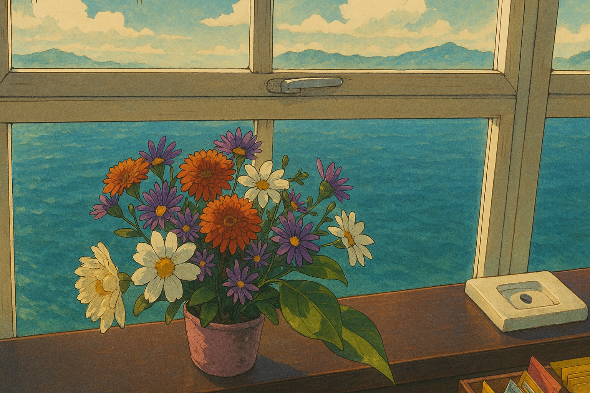
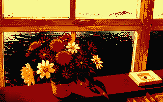

# conv2SGX

Convert PNG/JPG images to SymbOS SGX graphic format, for use as wallpapers or sprites on [SymbOS](https://symbos.org) (Z80-based OS for Amstrad CPC, MSX, etc.).

## Features

- **4-colour mode** — CPC Mode 1 encoding (4 pixels/byte), output as two 160×200 chunks matching the SymbOS wallpaper loader's expected layout
- **16-colour mode** — MSX Screen 5 encoding (2 pixels/byte), extended SGX chunks
- **ZX0 compression** — inverted ZX0 (Salvador optimal compressor) with SymbOS Banking_Decompress wrapper; typically 40–70% size reduction
- **Uncompressed output** — `--no-compress` produces raw SGX matching the official FantasyKeithParkinson/EroticPhotos wallpaper format
- **Dithering** — Floyd-Steinberg (default), Atkinson, ordered (Bayer), or none
- **Flexible scaling** — fit, stretch, scale factor, or exact dimensions

## Requirements

- Python 3 + Pillow (`pip install Pillow`)
- `zx0tool` binary (for compression) — build it once:

```bash
make zx0tool
```

The Makefile links against the [Salvador](https://github.com/emmanuel-marty/salvador) ZX0 optimal compressor. Salvador source must be present at `../rasm/salvador/src/`.

## Usage

```
conv2sgx.py [-h] [-o FILE] [-c {4,16}] [-d {none,floyd-steinberg,atkinson,ordered}]
            [-W PX] [-H PX] [-s FACTOR] [--fit WxH] [--no-aspect]
            [--preview] [--no-compress]
            input
```

### Options

| Option | Description |
|--------|-------------|
| `-o FILE` | Output path (default: `<input>.sgx`) |
| `-c {4,16}` | Colour depth — 4 (CPC Mode 1) or 16 (MSX Sc5), default 16 |
| `-d DITHER` | Dithering: `floyd-steinberg` (default), `atkinson`, `ordered`, `none` |
| `-W PX` | Target width |
| `-H PX` | Target height |
| `-s FACTOR` | Uniform scale factor (e.g. `0.5`) |
| `--fit WxH` | Fit within WxH preserving aspect ratio |
| `--no-aspect` | Stretch to exact size (use with `-W` / `-H`) |
| `--preview` | Save a PNG preview alongside the SGX |
| `--no-compress` | Raw uncompressed output (no ZX0) |

### Examples

```bash
# Standard 4-colour wallpaper (320×200, compressed, Floyd-Steinberg)
python3 conv2sgx.py photo.png -c 4 -W 320 -H 200 --no-aspect

# Same but uncompressed (matches official wallpaper format)
python3 conv2sgx.py photo.png -c 4 -W 320 -H 200 --no-aspect --no-compress

# 16-colour, Atkinson dither, fit into 320×200
python3 conv2sgx.py photo.png -c 16 -d atkinson --fit 320x200

# Half-size with preview
python3 conv2sgx.py photo.png -s 0.5 --preview
```

## SGX Format Notes

### 4-colour (simple chunks)

- Header: `[row_bytes|0x80] [width_px] [height_px]` (compressed) or `[row_bytes] [width_px] [height_px]` (raw)
- Compressed: followed by 2-byte LE payload size + ZX0 payload
- Raw: followed by pixel data directly
- `row_bytes` = width / 4; must be ≤ 63 (6-bit field)
- SymbOS wallpaper loader requires **160px-wide chunks** (row_bytes=40); 320px images split into two 160×200 chunks

### 16-colour (extended chunks)

- Header: `0xC0 0x05 [row_bytes_lo] [row_bytes_hi] [w_lo] [w_hi] [h_lo] [h_hi]` (compressed)
- Or `0x40 0x05 ...` for uncompressed
- Compressed: followed by 2-byte LE payload size + ZX0 payload

### ZX0 / SymbOS wrapper

SymbOS uses **inverted ZX0** (V2). The Banking_Decompress wrapper format is:

```
[last 4 bytes of uncompressed data] [0x00 0x00] [ZX0 stream of all-but-last-4 bytes]
```

All SGX files end with a 3-byte null terminator (`00 00 00`).

## Samples

The `samples/` directory contains example wallpapers (320×200, 4-colour) generated from `manado-miyazaki.png`:

| File | Dither | Compressed | Size |
|------|--------|------------|------|
| manadFC.sgx | Floyd-Steinberg | Yes | ~9.9 KB |
| manadFU.sgx | Floyd-Steinberg | No | 16009 B |
| manadAC.sgx | Atkinson | Yes | ~12.7 KB |
| manadAU.sgx | Atkinson | No | 16009 B |
| manadNC.sgx | None | Yes | ~5.2 KB |
| manadNU.sgx | None | No | 16009 B |
| manadOC.sgx | Ordered | Yes | ~6.3 KB |
| manadOU.sgx | Ordered | No | 16009 B |

Naming: `manad{F/A/N/O}{C/U}.sgx` — dither initial + C(ompressed) or U(ncompressed).
